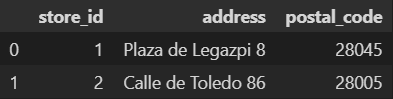

# SQL-Project

## Índice

1. [Descripción](#descripción)
2. [Objetivo principal](#objetivo)
3. [Análisis](#análisis)
4. [Querys](#querys)
5. [Conclusiones](#conclusiones)

<a name="descripción"/>

## Descripción

En este proyecto de SQL, nos hemos encargado de limpiar y organizar distintos archivos de información para luego introducir los datos en nuestra base de datos de MySQL. A continuación, hemos llevado a cabo diversas consultas para obtener información relevante y realizar análisis sobre los datos almacenados.

<a name="objetivo"/>

## Objetivo principal

El objetivo principal de este proyecto es crear y entregar al cliente una base de datos coherente y fácil de manejar. Para lograrlo, nos proponemos organizar las diferentes operaciones realizadas por el negocio en distintas tablas de la base de datos. De esta manera, el personal encargado podrá registrar todos los datos en una única tabla, según la actividad que se esté llevando a cabo.

Al establecer relaciones entre las diversas tablas, el cliente podrá realizar consultas que le proporcionen información relevante y actualizada sobre el funcionamiento del videoclub. Estas consultas permitirán obtener insights valiosos y tomar decisiones informadas para mejorar la eficiencia y el rendimiento del negocio. Con la base de datos bien estructurada, se facilitará el análisis y la gestión de la información para garantizar el éxito del videoclub.

<a name="análisis"/>

## Análisis

### Transformación

En esta etapa, comenzamos eliminando ciertas columnas que no son relevantes para nuestro análisis. Luego, realizamos la manipulación de los valores nulos en los distintos dataframes para asegurar que los datos estén limpios y consistentes. Además, llevamos a cabo operaciones de merge entre algunos dataframes para combinar la información de manera adecuada y obtener conjuntos de datos más completos y útiles.

### Creación

Posteriormente, creamos nuevos dataframes a partir de la información disponible para complementar y enriquecer nuestros datos. Estos nuevos dataframes se diseñan para proporcionar una visión más completa y detallada de la información requerida para el proyecto.

 

### Introducción

Finalmente, en esta etapa, nos encargamos de cargar y introducir toda la información ya acomodada en nuestra base de datos de MySQL. Aseguramos que la información esté correctamente estructurada y se establecen relaciones apropiadas entre las tablas para facilitar las consultas y obtener información valiosa del videoclub.

<a name="querys"/>

# Querys

Una vez que hemos establecido nuestra base de datos con sus respectivas relaciones, procedemos a realizar algunas consultas de interés que nos ayudarán a encontrar información necesaria para nuestro videoclub. Estas consultas están diseñadas para obtener datos relevantes, realizar análisis y tomar decisiones informadas que impulsen el funcionamiento y el éxito de nuestro negocio. A través de estas consultas, podremos acceder a información actualizada y significativa sobre la gestión del videoclub, los clientes, las películas disponibles y otras métricas clave que nos permitirán mejorar y optimizar nuestras operaciones.

<b>Obtener el top 10 de películas más rentadas</b>

 

 

<b>Obtener todas las películas de una categoría determinada</b>

 

 

<b>Obtener el total de alquileres realizados por cada cliente</b>

 

 

<b>Obtener la cantidad de películas en cada categoría</b>

 

 

<b>Obtener las películas más largas (con mayor duración) de cada categoría</b>

 

 

# Conclusiones

Después de completar la limpieza y adaptación de los archivos .csv y la posterior inserción en MySQL, hemos logrado crear una base de datos completa y funcional para el videoclub. Gracias a las relaciones establecidas entre las tablas, hemos podido realizar una serie de consultas que nos han proporcionado información valiosa sobre el funcionamiento del negocio.

Entre las distintas consultas realizadas, hemos obtenido datos como las películas más rentadas, la cantidad de películas por categoría, el total de alquileres realizados por los clientes, la cantidad de películas en cada categoría y las películas con mayor duración en cada una de las categorías. Toda esta información nos ha brindado una visión más clara y precisa del negocio, lo que a su vez nos ayudará a tomar decisiones más informadas y a mejorar el servicio ofrecido al cliente.

Gracias a la base de datos bien organizada y a las consultas eficientes, hemos ganado una herramienta poderosa para analizar y gestionar el videoclub de manera efectiva. Estamos entusiasmados con las posibilidades que esto ofrece y confiamos en que nos permitirá impulsar el negocio hacia un futuro exitoso.